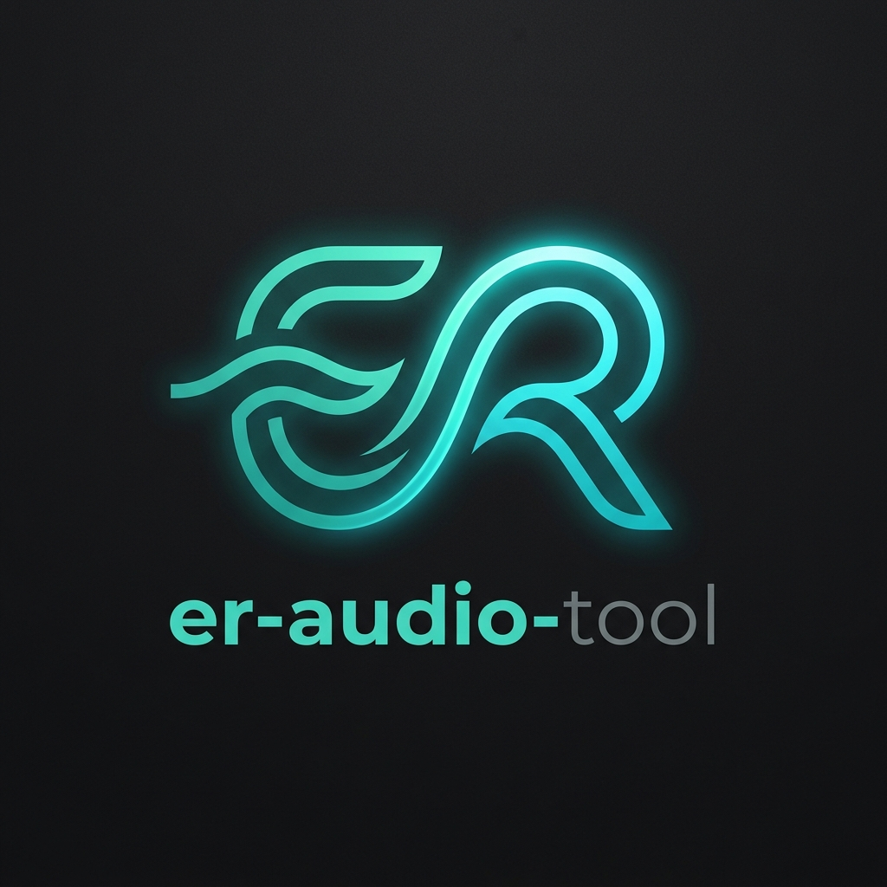

# er-audio-tool

<p align="center">
  
</p>

<p align="center">
  <a href="https://github.com/Eidolf/ER-Audio-Tool/actions"></a>
  <a href="https://opensource.org/licenses/MIT"></a>
</p>

A privacy-conscious, local-first desktop audio suite for Windows and Linux. Record system audio, process streams, and browser tabs with zero telemetry, analyze acoustic properties, transcribe audio to standard MIDI, and render MIDI back to MP3 using synthesized instruments.

---

## Key Features

1. **Native WASAPI Loopback Capture (Windows)**  
   - Direct render endpoint capture without requiring "Stereo Mix" or virtual drivers.
   - Enumerate audio render devices and active application process sessions.

2. **PipeWire & PulseAudio Desktop Capture (Linux)**  
   - Native `pw-record` and PulseAudio monitor source capture.
   - Operates without root privileges and respects desktop portal boundaries.

3. **Consent-Based Browser Tab Audio (Chrome / Edge Companion)**  
   - Dedicated Manifest V3 companion extension.
   - Cryptographically authenticated loopback bridge (`127.0.0.1`).
   - Keeps local tab audio audible during capture; clear active recording badge.

4. **Technical Audio Analysis**  
   - Local inspection of MP3, WAV, and FLAC files.
   - Measured peak dBFS, RMS loudness, clipping counter, silence segmentation.
   - Musical estimates for tempo (BPM) and tonal key center.

5. **Audio to MIDI Transcription**  
   - Offline pitch tracking and note onset detection.
   - Exports standards-compliant SMF `.mid` files.
   - Multiple profiles: Melody, Piano, Bass, Vocals, Percussion.

6. **MIDI to MP3 Rendering**  
   - Synthesizes MIDI notes into WAV and MP3 audio.
   - SoundFont and instrument preset choices.

7. **Privacy & Local-First Integrity**  
   - Zero telemetry, cloud uploads, or tracking.
   - Redacted logs (credentials and secrets stripped).

---

## Roadmap Features (Coming Soon)

- **ML-Based Stem Separation**: Professional-quality source separation using deep learning models (Demucs/Spleeter)
- **Full Multi-Track MIDI**: Complete arrangement export with synchronized tracks and instruments
- **Windows Application Audio**: Process-specific audio capture (pending native Windows API integration)

---

## Supported Platforms

- **Windows**: Windows 10 (19041+) and Windows 11 (x64 / ARM64 ready)
- **Linux**: Ubuntu 22.04+, Debian 12+, Fedora 38+, Arch Linux (PipeWire or PulseAudio)

**Note:** macOS is not officially tested but may work (similar to Linux).

---

## Architecture Overview

```
er_audio_tool/
├── core/             # State machine, versioned settings, redacted logging
├── audio/            # Capture backends (WASAPI, PipeWire, PulseAudio, Mock)
│   ├── backends/
│   ├── buffer.py     # Thread-safe ring buffer, level/clipping meter
│   └── encoder.py    # Atomic crash-safe file exporter
├── browser/          # Loopback-only companion service (127.0.0.1)
├── analysis/         # Audio loudness, clipping, tempo & key analyzer
├── midi/             # Pitch tracker, MIDI exporter, and MP3 synthesizer
├── gui/              # CustomTkinter 8-workspace interface
└── i18n/             # English and German translations
```

---

## Quick Start & Installation

### Requirements
- Python 3.9+ (or use portable standalone release binary)
- FFmpeg (optional: can be downloaded automatically on-demand in **Settings > FFmpeg & Codecs** with scope selection and automatic session cleanup)

### Install via pip:
```bash
git clone https://github.com/skillerious/Loopback-Recorder.git er-audio-tool
cd er-audio-tool
pip install -e .
er-audio-tool
```

---

## Documentation

### Quick Links
- 📖 **[Browser Extension Setup Guide](BROWSER_EXTENSION_SETUP.md)** - Complete step-by-step extension installation
- 🔧 **[Troubleshooting Guide](TROUBLESHOOTING.md)** - Solve common issues and errors
- 🔒 **[Security & Privacy Statement](SECURITY_PRIVACY.md)** - How we protect your data
- 🎵 **[Codec Support Matrix](CODEC_SUPPORT.md)** - Detailed format compatibility
- 📋 **[Changelog](CHANGELOG.md)** - Version history and changes
- 🏗️ **[Architecture Overview](ARCHITECTURE.md)** - Technical design
- ⚖️ **[Third-Party Notices](THIRD_PARTY_NOTICES.md)** - Open source licenses

### Browser Companion Setup (Quick Start)

For detailed instructions with screenshots and troubleshooting, see **[BROWSER_EXTENSION_SETUP.md](BROWSER_EXTENSION_SETUP.md)**.

**Quick setup:**
1. Open `chrome://extensions` in Chrome, Edge, or Brave
2. Enable **Developer Mode** (top-right toggle)
3. Click **Load unpacked** and select the `browser_extension/` directory
4. Copy your pairing token from **Settings > Browser Integration** in er-audio-tool
5. Paste token into extension popup and authenticate

---

## Known Limitations

- **Windows Application Audio**: Currently unavailable (honestly reported in UI). Use System Output mode to capture all system audio.
- **Stem Separation**: Placeholder implementation (no ML model yet). Under consideration for future release.
- **Full MIDI Arrangement**: Currently outputs single track. Multitrack implementation in progress.

See **[Troubleshooting Guide](TROUBLESHOOTING.md)** for workarounds and details.

---

## Security & Privacy

er-audio-tool is designed with privacy as a core principle:

- ✅ **100% Local Processing** - All audio stays on your device
- ✅ **Zero Telemetry** - No analytics, tracking, or data collection
- ✅ **No Cloud Services** - No external servers, no uploads
- ✅ **Open Source** - Verify our privacy claims yourself
- ✅ **Loopback-Only Server** - Browser extension communicates only with localhost
- ✅ **Strong Authentication** - 192-bit cryptographic tokens

Read the complete **[Security & Privacy Statement](SECURITY_PRIVACY.md)**.

---

## Troubleshooting

**Common issues:**

- **No audio devices found** → Check audio drivers and backend availability
- **Empty recordings** → Verify source is playing audio, check level meters
- **Browser extension won't connect** → Verify token, ensure desktop app is running
- **M4A files won't convert** → Install FFmpeg via Settings > Setup & Codecs
- **Language switch doesn't work** → Should be immediate; report if not

See the complete **[Troubleshooting Guide](TROUBLESHOOTING.md)** for solutions to these and many other issues.

---

## Contributing

Contributions are welcome! Please:

1. Check existing issues before creating new ones
2. Follow existing code style and architecture patterns
3. Add tests for new features
4. Update documentation for user-facing changes
5. Respect the security and privacy principles

---

## Attribution and Lineage

> **Notice**: er-audio-tool was originally derived from [skillerious/Loopback-Recorder](https://github.com/skillerious/Loopback-Recorder) by Robin Doak. The original project is available under the MIT License. er-audio-tool is an independently maintained project and is not affiliated with or endorsed by the original author.

---

## License

er-audio-tool is licensed under the [MIT License](LICENSE).  
Copyright (c) 2025 Robin Doak (Original Lineage)  
Copyright (c) 2026 Eidolf (er-audio-tool Maintainer)

See **[THIRD_PARTY_NOTICES.md](THIRD_PARTY_NOTICES.md)** for open source dependencies and their licenses.

---

## Support

- 📖 **Documentation**: See links at top of README
- 🐛 **Bug Reports**: [GitHub Issues](https://github.com/Eidolf/ER-Audio-Tool/issues)
- 💬 **Questions**: [GitHub Discussions](https://github.com/Eidolf/ER-Audio-Tool/discussions) (if enabled)
- 📧 **Security Issues**: andreas@eidolf.de (private disclosure)
